# Can news insights predict stock moves?

**No — and the evidence is unusually clean.** Five model families, six targets, two
measurement windows and a 50× range of model capacity all land at or below a
predictor that ignores every input and guesses the average. The conclusion holds for
forecasting the move *after* an article, and it holds for describing the move that had
*already happened* 30 minutes before it.

> Everything below comes from two artifacts in this repo:
> `train_news_model.ipynb` (a single executed run, all figures) and
> the CLI experiments recorded in `tries.md`.

---

## 1. The corpus

`news_trading_window`: **6,333 articles** across 118 AI/compute tickers,
2024-09 → 2026-09, 497 NYSE trading days. Restricted to trading days between the open
and 90 minutes before the close. **5,506** carry LLM-distilled insight text
(25,000 insight boxes), which is the model input.

Split 60/20/20 by `model_set`, ticker-balanced, with the most recent trading days
reserved wholesale as a temporal holdout:

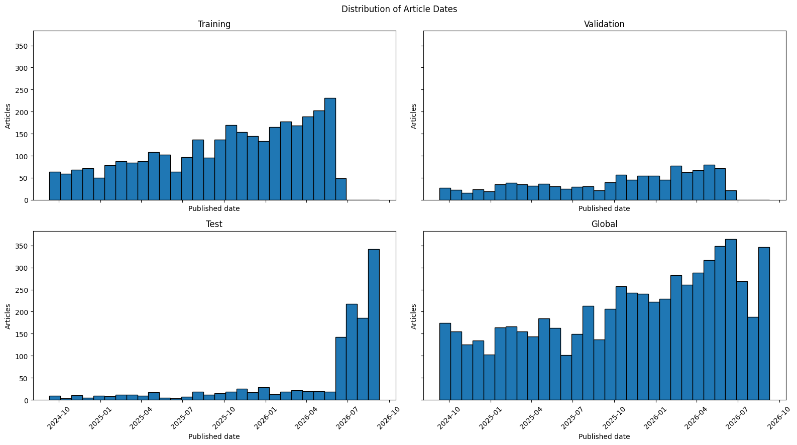

The test split is deliberately concentrated in the newest months — a model cannot
learn a day and replay it. Targets are tight and near-symmetric around zero:

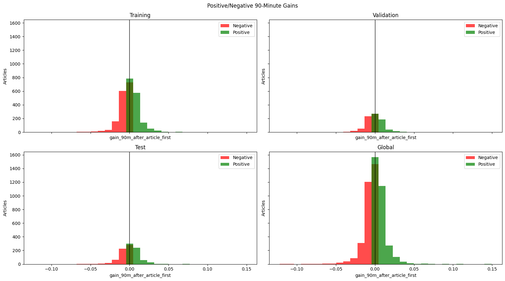

| target | sd | comment |
|---|---|---|
| 90 min after article | **109 bps** | the primary task |
| −30 min → +90 min | 136 bps | wider window, includes pre-publication drift |
| −30 min → article | 87 bps | pure hindsight |

The same shape holds for the intraday move up to the article — a tight,
near-symmetric distribution centred on zero, in every split:

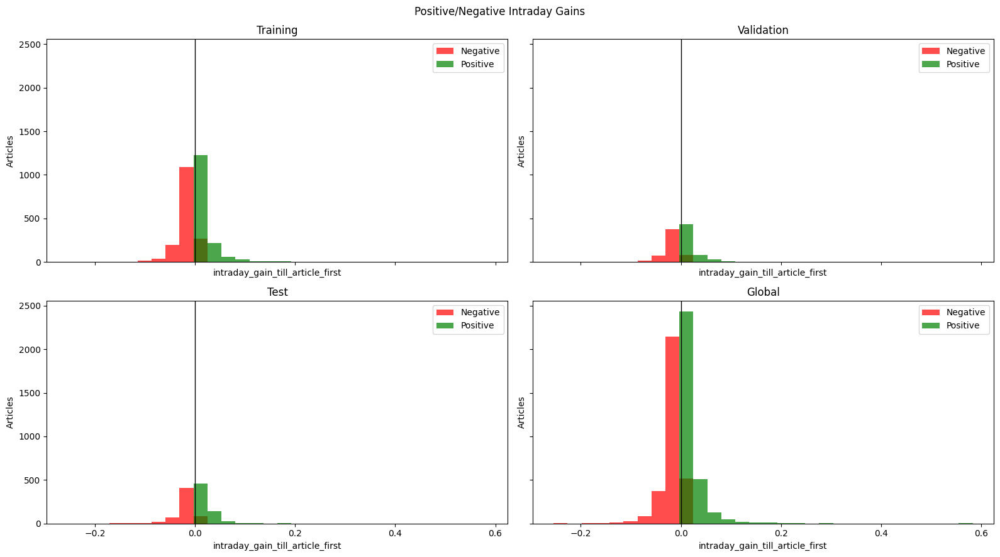

The distilled sentiment labels skew positive:

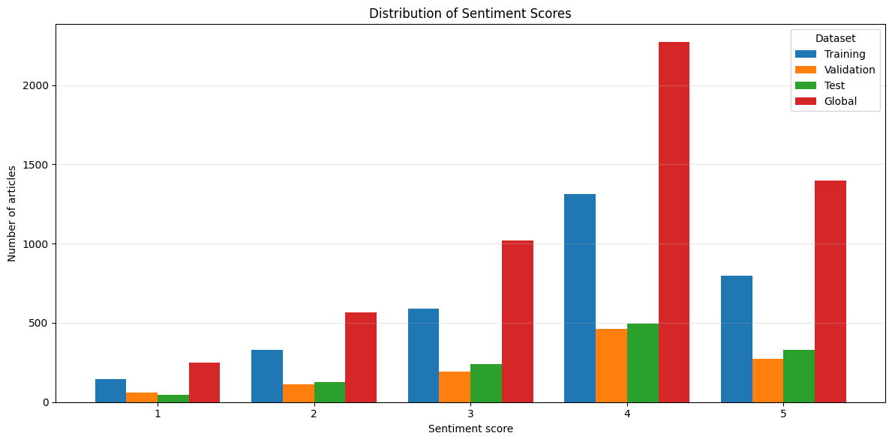

---

## 2. The finding that precedes every model

Before a single model is trained, cross-tabulating the LLM's sentiment against the
direction of the subsequent move:

| sentiment | down | up |
|---|---|---|
| Strongly negative | 50.80% | 49.20% |
| Negative | 49.82% | 50.18% |
| Neutral | 51.14% | 48.86% |
| Positive | 49.76% | 50.24% |
| Strongly positive | 50.14% | **49.86%** |

**Every class is a coin flip.** Strongly-negative articles are followed by an up-move
49.2% of the time; strongly-positive, 49.9%. One percentage point separates the
extremes, well inside sampling noise on 5,500 rows.

This is a statement about the data, not about any model. Everything that follows is
constrained by it.

### Is 90 minutes even the right horizon?

A second data-side check, asking whether the target itself is learnable before asking
whether a model can learn it. Sentiment against the realised move, bucketed into
Loss / Neutral / Gain at a ±0.5% threshold:

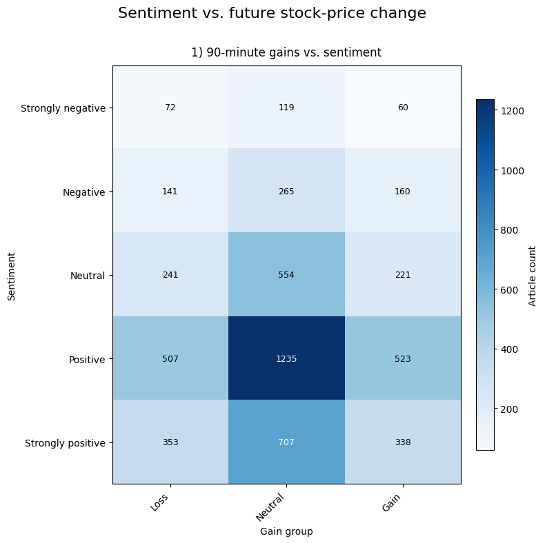

| sentiment | Loss | Neutral | Gain | neutral % | loss share of non-neutral |
|---|---|---|---|---|---|
| Strongly negative | 72 | 119 | 60 | 47.4% | 54.5% |
| Negative | 141 | 265 | 160 | 46.8% | 46.8% |
| Neutral | 241 | 554 | 221 | 54.5% | 52.2% |
| Positive | 507 | 1,235 | 523 | 54.5% | 49.2% |
| Strongly positive | 353 | 707 | 338 | 50.6% | 51.1% |
| **total** | **1,314** | **2,880** | **1,302** | **52.4%** | **50.2%** |

Two things fall out of it:

1. **52.4% of articles are followed by a move smaller than ±0.5%.** More than half the
   corpus is "nothing happened". Training a regressor against a target that is mostly
   noise around zero is hard for a reason that has nothing to do with the model.
2. **Of the articles that did move, the split is 50.2% down / 49.8% up** — and the
   per-row loss share wanders between 46.8% and 54.5% with no ordering by sentiment.
   The strongly-negative row is 54.5% losses; the merely-negative row is 46.8%.

The natural follow-up — does a longer horizon help? — is built but not yet measured:
`scripts/enrichment/add_extended_gain_features.py` adds `gain_24h_after_article` and
`gain_7d_after_article` via yfinance. Those columns are not yet populated in this
corpus, so the notebook plots the 90-minute panel alone and reports the other two as
missing. Longer windows do contain more movement; whether the direction becomes
predictable is open.

---

## 3. What was built

| § | family | input | notes |
|---|---|---|---|
| 2a | Encoder-NN, separate | text → sentiment, then sentiment + market floats | two-stage |
| 2b | Encoder-NN, combined | same, trained end-to-end | |
| 2c | JSON-LLM, LoRA | all inputs as raw JSON | 1.04B params, 6.3M trainable |
| 2d | Text+Floats regressor | DeBERTa-v3 + 10-dim dense vector | `model_shay` |
| 2e | Gradient-boosted tree | the 10-dim dense vector only | `model_tree` |

Section 2d's dense vector is 3 market floats + a 5-dim sentiment one-hot + a 2-dim
actionability one-hot. Section 2e strips the encoder entirely, so **the gap between
2d and 2e is what the text contributes**.

Methodology that makes the nulls trustworthy:

- **`GroupKFold` on `(ticker, trading-day)`** — 46% of rows share a ticker-day with
  another row (largest cluster: 30 articles). Two articles on the same name minutes
  apart have near-identical targets; ungrouped folds would straddle them and inflate
  every metric.
- **Scalers and target transforms fitted on the training fold only.**
- **Leakage guards enforced in code** — a target identical to an input feature is
  refused, not reported.

---

## 4. Results

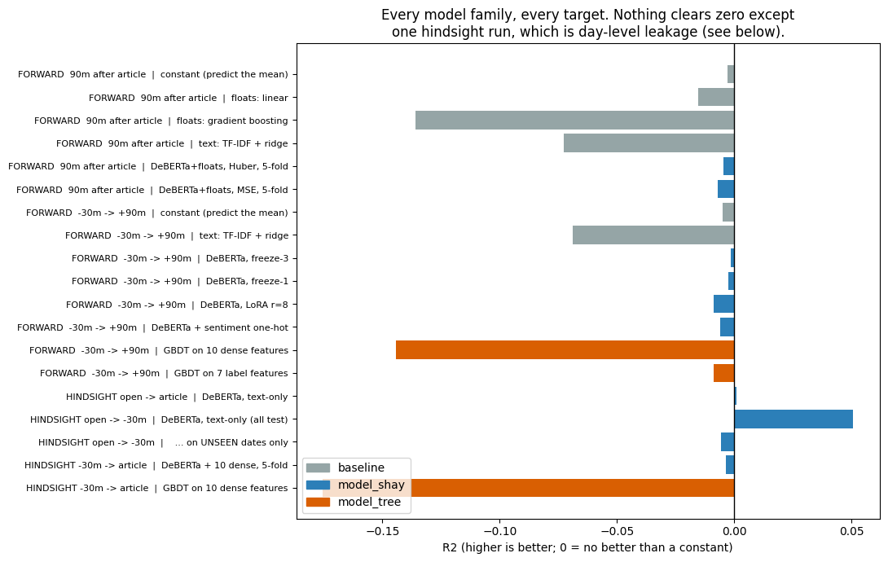

Scored on the same held-out split (n=1,236, sd 109 bps):

| § | model | test MAE | R² |
|---|---|---|---|
| — | **constant** (predict the mean) | **74.1 bps** | **0.0000** |
| 2a | Fusion Network | 78.5 bps | −0.0529 |
| 2b | Combined Encoder-NN | 75.1 bps | −0.0049 |
| 2c | JSON-LLM, LoRA | 274.1 bps | −14.44 ※ |
| 2d | Text+Floats regressor (full corpus) | 89.6 bps | −0.0015 |
| 2e | GBDT on 10 dense features | ~98 bps | −0.1559 ± 0.0579 |

**Nothing beats the constant.** The best result, 2b at −0.0049, matches it to three
decimals — which is what converging to the mean looks like under squared-error loss.

※ 2c's −14.44 is far worse than everything else; its MAE is 3.7× the baseline, which
no regressor on this target should manage. Read it as "did not converge usefully"
rather than as a ranked result.

Baselines behave the same way, and the flexible ones do *worse* than the trivial one —
the signature of fitting noise:

| baseline | 90m target | −30m→+90m |
|---|---|---|
| constant | −0.0029 | −0.0049 |
| floats: linear | −0.0152 | −0.0097 |
| floats: gradient boosting | −0.1358 | −0.0993 |
| text: TF-IDF + ridge | −0.0726 | −0.0689 |

### Directional accuracy — the practical question

R² measures magnitude. For trading, the question is simpler: does it get the
*direction* right? Each family, scored on the same 1,236 held-out articles:

| § | model | same sign | different sign | within ±50 bps |
|---|---|---|---|---|
| 2a | Fusion Network | **48.38%** | 51.62% | 578 / 1,236 |
| 2b | Combined Encoder-NN | **49.43%** | 50.57% | 610 / 1,236 |
| 2c | JSON-LLM, LoRA | **52.19%** | 47.81% | 84 / 1,236 |

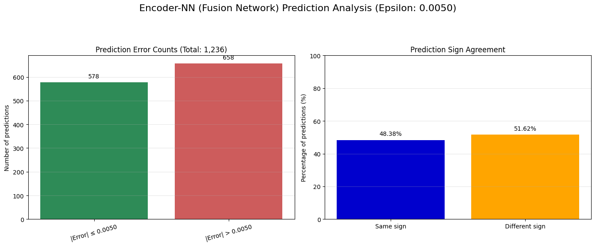

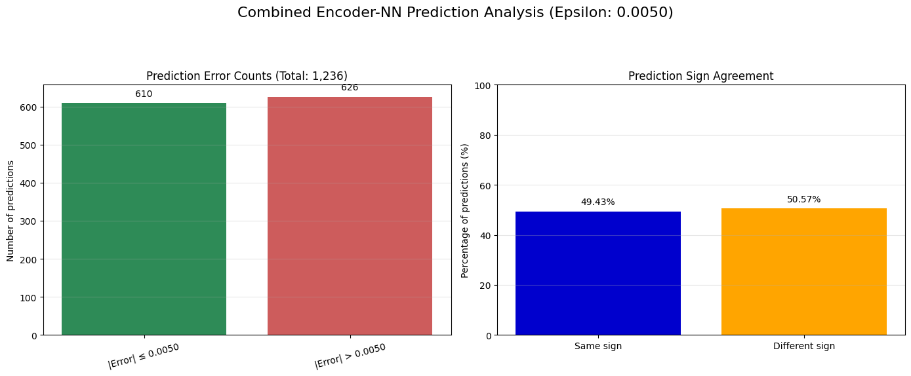

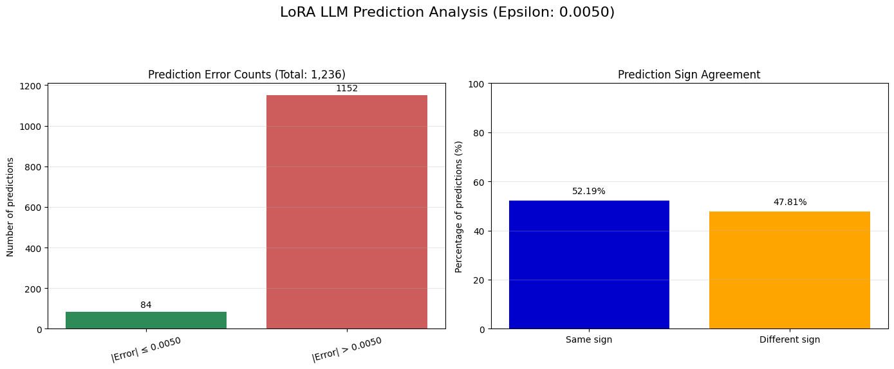

Two of the three are **below a coin flip**. The third, at 52.19%, is 1.5 standard
errors from chance (SE = 1.42 pp on n = 1,236) — the kind of number that appears and
vanishes between runs, and it comes from the model with by far the worst magnitude
error: only 84 of its 1,236 predictions land within ±50 bps, against 578 and 610 for
the other two.

No family achieves directional skill worth acting on.

### Training curves

The three notebook families converge cleanly — this is not a failure to optimise:

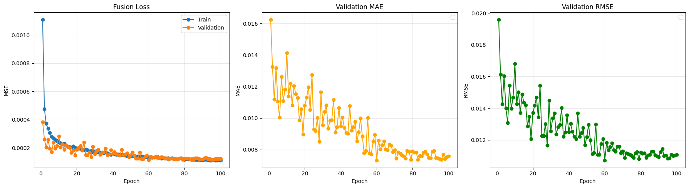

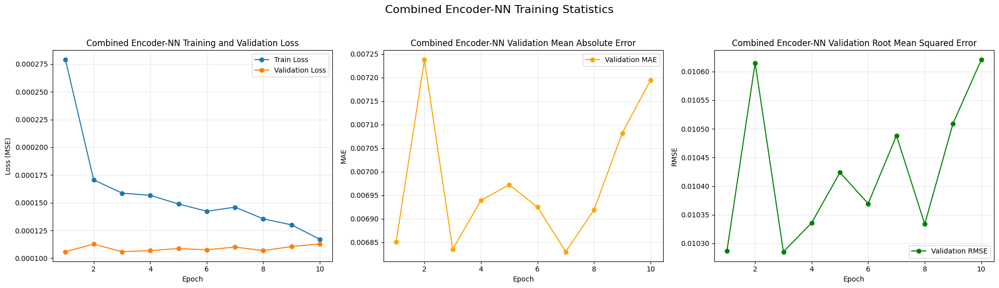

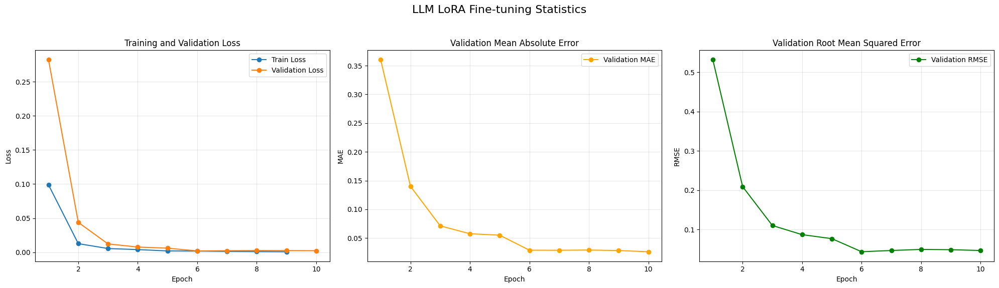

Validation error flattens early and stays flat while training error keeps falling.
The models are learning the training set, not the relationship.

### The models emit a constant

Prediction spread, as a fraction of target spread:

| run | trainable params | R² | pred spread |
|---|---|---|---|
| LoRA r=8 | 0.4M | −0.0086 | 2.8% |
| freeze-1 | 7.3M | −0.0025 | 2.7% |
| freeze-3 | 21.4M | −0.0015 | 2.6% |

**Capacity varies 50×; prediction spread varies 2.6% → 2.8%.** The model outputs
roughly a constant no matter how much of it is trainable.

### What the tree leans on

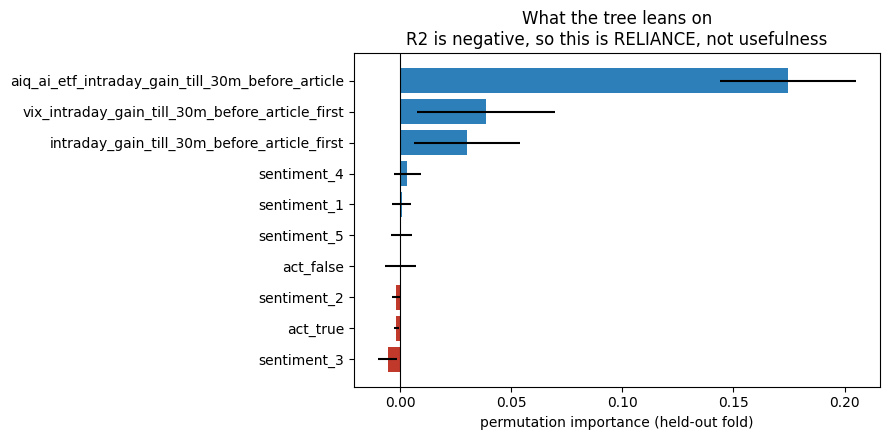

Because R² is negative, this chart is **reliance, not usefulness** — the features the
tree leans on are exactly why it loses to the mean. The two dominant ones are
market-wide series identical for every article on a given day: it is memorising days.
Several sentiment dimensions score *negative* importance: shuffling them **improves**
held-out performance.

---

## 5. It is not a tuning failure

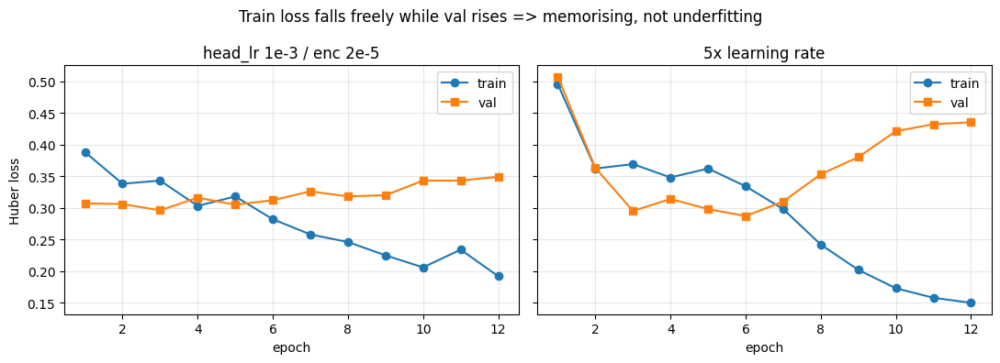

Train loss falls freely (0.388 → 0.192) while validation *rises* (0.307 → 0.349). At
5× the learning rate it memorises harder and generalises worse. The model is not
capacity-starved or under-trained — it is signal-starved.

| hypothesis | probe | outcome |
|---|---|---|
| broken training | fp16 weights loaded by `transformers≥5` `dtype="auto"` → NaN | found and fixed |
| underfitting / LR too low | LR probe above | memorises freely |
| too much capacity | 0.4M → 21.4M trainable | flat |
| needs deeper fine-tuning | full 12-layer unfreeze | worse in every run |
| wrong loss | Huber vs MSE, 5-fold | −0.0046 vs −0.0070 |
| wrong ticker attribution | `primary_ticker` vs `first_mentioned_ticker` | both null |
| wrong window | at-article vs −30m | both null |
| corpus too noisy | restrict to actionable articles | **worse** — the full-population model beat the actionable-trained model *on the actionable rows themselves* (corr +0.127 vs +0.041) |
| pipeline cannot read text | predict sentiment from text | encoder: train MSE 2.60 → 0.18, test MAE 0.388 on a 1–5 scale. TF-IDF classifier: 55.0% acc vs 42.7% majority. **It reads fine** |

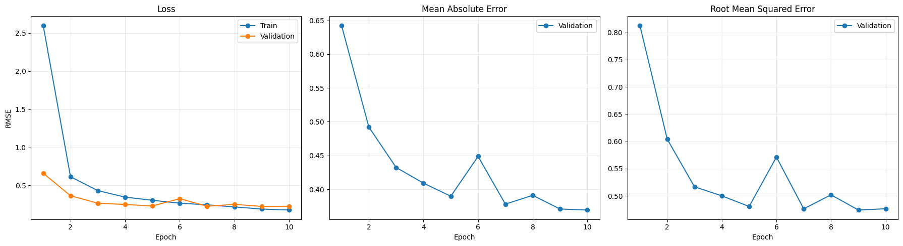

The encoder learns sentiment from text without difficulty. It is the mapping from
text to *future return* that does not exist.

---

## 6. The one positive result, and why it does not count

Predicting the move from the open to 30 minutes *before* publication — pure hindsight —
produced the only run that genuinely committed: **R² +0.0508, corr +0.2315**,
prediction spread 27.3% (versus ~2.6% everywhere else), trained 7 epochs.

Split by date, it evaporates:

| | n | R² | corr |
|---|---|---|---|
| test rows on dates **seen** in training | 312 | **+0.1541** | +0.4107 |
| test rows on **unseen** dates | 815 | **−0.0056** | +0.1271 |

The model learns *"that morning was strong"* from other articles on the same date and
applies it to a different ticker — **day-level market state, not article-level
information**. Not row duplication: only 110 test rows (9.8%) share a ticker-day with
training, and those scored *worse* than the clean rows.

What survives on unseen dates is small but statistically real: corr +0.1271 at row
level, **+0.1678 aggregated to ticker-day means (t = 3.94)**. It never becomes
positive R².

And when the hindsight window narrows to the 30 minutes immediately before
publication — stripping the market drift the model was exploiting — even that
disappears: **−0.0035 ± 0.0042** across five grouped folds.

---

## 7. Conclusion

**The corpus and its distilled insights do not support a profitable model.**

The models collapse to the mean only when there is nothing to find, which is correct
behaviour rather than a defect: under MSE or Huber, the loss-minimising output given
no usable conditioning information *is* the unconditional mean.

The articles describe what the market already did. That is what the data contains, and
it is what every model found.

### What would have to change — the data or the question, not the model

1. **Information that precedes the move.** This corpus is retrospective by
   construction.
2. **A market-adjusted target.** The strongest thing these features explain is the
   day's market direction; residualising against the sector ETF would strip it and
   show whether anything ticker-specific remains.
3. **Sign classification with AUC**, so a ~0.1 correlation is legible instead of
   erased by squared error.
4. **Substantially more data.** The actionable-subset experiment showed 1,023 rows is
   below the floor for this setup; 3k is likely below it too.

---

## Appendix — reproducing

```bash
model-shay baselines --30m
model-shay train --30m --kfold --batch-size 32 --eval-test --out-dir runs/cv-30m
model-shay train --30m_till --sentiment --act --kfold --out-dir runs/30m_till-sent
model-tree  train --30m --sentiment --act --kfold --eval-test --out-dir runs/tree-30m
```

Per-fold metrics, configs and length reports: `model_shay/runs/*/summary.json`,
`model_tree/runs/*/`. Full write-up: `tries.md`. Executed notebook with all figures:
`train_news_model.ipynb`.
